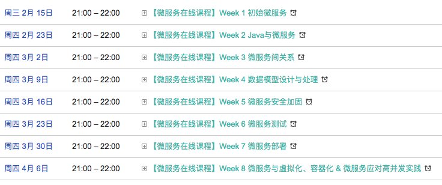

## 注意事项

* 学习资料相关在study目录中，见 [study/README.md][aa8dd5e6]
* 为了更好的授课效果，请大家先填下课前问卷。 [http://cn.mikecrm.com/pC5GBOs][fe40aea2]
* 本课程相关代码仅供授课学习之用，请勿直接使用至生产环境。

## 技术应用背景介绍

微服务是一种软件架构风格，它是以专注于单一责任与功能的小型功能区块为基础，利用模组化的方式组合出复杂的大型应用程序，各功能区块使用与语言无关的 API 集相互通讯；微服务架构设计风格代表了下一代的架构设计思想，配合现在的容器工具（如Docker），可以在软件开发流程、部署、服务维护等各方面产生新的生产效率提升；通过微服务可以更好地体现业务逻辑、更快地交付软件，并且借助IAAS平台，能够快速地扩展服务支撑更大的访问流量压力。

## 课程内容简介

课程以架构设计历史简述为始，结合常用技术框架及工具帮助学员快速上手实现第一个微服务，再通过微服务实践过程中需要注意的数据模型、服务间通信等来进行多个微服务的设计实践，最后从测试、部署的角度来叙述在微服务最后上线及维护的相关事宜；课程将从“初始微服务”来简述服务架构设计风格的发展历程和微服务的由来；通过“Java与微服务”来介绍常用的快速上手Java微服务技术框架；通过“微服务间关系”、“数据模型设计与处理”、“微服务安全加固”课程来详细阐述微服务在实战过程中的原则和技巧；通过“微服务测试”、“微服务部署”、“微服务与虚拟化、容器化”课程来帮助学员掌握微服务测试到最后上线及服务的实践。

## 课程标题

跟我做一个Java微服务实战项目

## 讲师介绍

9年以上互联网/移动互联网开发经验，6年以上技术管理经验，擅长移动App和Web网站研发管理、项目管理，负责过千万级用户社交产品的技术架构体系建设；经历过Web 2.0及移动互联网创业浪潮，曾任创业公司技术负责人，从零构建技术团队完善技术架构并成功支撑亿级请求，现任迅雷技术总监；早期全栈工程师，带过移动客户端、服务端、大数据分析、运维、智能硬件团队，对于开源项目了解、对于新技术和技术趋势有着良好的理解；对于如何在创业公司及成熟公司内带领研发团队进行敏捷开发和研发流程优化有着自己的方法，对于如何进行研发团队建设有着良好的经验，对于如何进行架构优化来适应快速增长的流量有着丰富的实战经验。

个人博客： https://junq.io  微信公众号：cnjunq

## 开课时间

* 暂定每周四晚 21:00-22:00
* 持续时间：8周

## 课程大纲

整个课程将由一个示例项目——eMall贯穿，eMall是一个示例的在线商城项目，通过这个项目学员可以以实践的方式来掌握微服务构建技巧。

* 第一节：初始微服务
    * 服务架构设计发展概述
    * 微服务简介
    * 服务的独立性与自主性
    * 服务的弹性与容错性
    * 自动化环境
    * 示例项目eMall介绍
* 第二节：Java与微服务
    * Java微服务常用框架
        * Spring Boot
        * Dropwizard
        * J2EE (Java Platform, Enterprise Edition)
    * 版本依赖关系工具
        * Apache Maven
        * Gradle
        * 其它工具
    * 如何设计服务
        * 领域驱动设计原则
        * 将领域元素转换为微服务
        * 应用与服务架构
        * 创建RESTful API
    * 课后习题
        * 【操作练习题】Git、Maven工具安装
        * 【操作练习题】使用Dropwizard、Spring Boot创建eMall项目微服务
* 第三节：微服务间关系
    * 服务注册与发现
    * 服务调用
    * 服务间通信
    * 课后习题
        * 【操作练习题】使用Zookeeper作为服务发现
        * 【操作练习题】使用Consul作为服务发现
* 第四节：数据模型设计与处理
    * 微服务数据定义
        * 从领域设计到实体
        * 数据的持久性
        * 跨服务数据共享
        * CQRS
    * 消息系统与协议
        * 消息系统
        * 常用协议
    * 课后习题
        * 【操作练习题】使用Kafka作为消息系统
        * 【思考题】有哪些常用开源消息系统，适用场景有哪些？
* 第五节：微服务安全加固
    * 网络分隔
    * 数据私密性保证
    * 身份识别与信任
    * 课后习题
        * 【操作练习题】HMAC、API密钥识别方式的实现
        * 【思考题】深度防御该如何做？
* 第六节：微服务测试
    * 测试分类
    * 不同环境下的测试
        * 单服务测试
        * 预生产环境测试
        * 生产环境测试
    * 课后习题
        * 【操作练习题】使用Mock工具进行测试
        * 【思考题】测试与研发过程的衔接时机问题
* 第七节：微服务部署
    * 自动化工具
    * 应用打包
        * JAR、WAR、EAR？
        * 容器化
        * 应用打包的最佳实践
    * 应用配置
    * 提升运维友好度
    * 度量指标与健康检测
    * 日志管理
    * 课后习题
        * 【操作练习题】将应用配置与应用程序分隔开的WAR包
        * 【思考题】微服务依赖部署关系该如何解决？
        * 【思考题】灰度发布该如何来做？
* 第八节 I：微服务与虚拟化、容器化
    * Linux虚拟化简介
    * 常见虚拟化方案介绍
    * 虚拟化与Java微服务实践
    * Linux容器简介
    * Docker介绍
    * Docker与Java微服务实践
    * 课后习题
        * 【操作练习题】构建eMall项目的Docker部署镜像
* 第八节 Part II：微服务应对高并发实践
    * 拥抱故障
    * 容量规划
    * 功能降级
    * 高扩展性
    * 自动伸缩
    * 【思考题】什么样的状况下不应该使用微服务？

## 时间安排

* 预演时间 1月5日
* 课程开始时间 2月15日 （春节后第二周）
* 周四晚 9:00-10:00 之间

[aa8dd5e6]: study/README.md "study/README.md"
[fe40aea2]: http://cn.mikecrm.com/pC5GBOs "http://cn.mikecrm.com/pC5GBOs"
