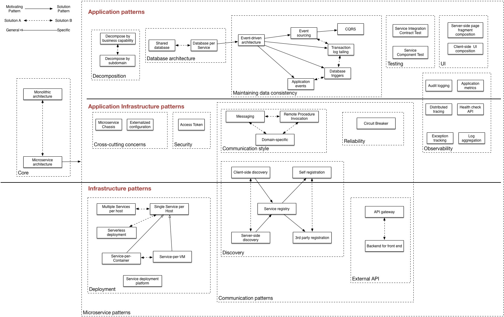

## 学习资料

### 开发环境准备

* 一台PC或Mac，推荐Mac或运行Linux的PC，具有终端、命令行，可翻墙
* [Oracle JDK 1.8][c55bd24c]
* [Apache Maven 3.2+][5afe3269]
* IDE：[Eclipse for Java Developers][d7369a3f] 或 [Spring Tool Suite][4ca8c5e7]
* SCM：[Git CLI][b220abea] 或 [SourceTree][b3494bf2]
* [Swagger Editor][2ca06797]
* [Spring Boot CLI 1.4.3][1889f5d8]（可选）
* [Postman][5dab86b4]（可选）

### Microservices Architecture Patterns

### 相关文章推荐

* [Introduction to Microservices][36b47fda]

  [c55bd24c]: http://www.oracle.com/technetwork/java/javase/overview/index.html "Oracle Java SE Development Kit"
  [5afe3269]: http://maven.apache.org/ "Apache Maven"
  [d7369a3f]: http://www.eclipse.org/downloads/packages/eclipse-ide-java-developers/neon2 "Eclipse for Java Developers"
  [4ca8c5e7]: https://spring.io/tools/sts/all "Spring Tool Suite"
  [b220abea]: https://git-scm.com/ "Git"
  [b3494bf2]: https://www.sourcetreeapp.com/ "SourceTree"
  [1889f5d8]: https://docs.spring.io/spring-boot/docs/current/reference/html/getting-started-installing-spring-boot.html#getting-started-installing-the-cli "Install Spring Boot CLI 1.4.3"
  [ae56c9de]: http://repo.spring.io/release/org/springframework/boot/spring-boot-cli/1.4.3.RELEASE/spring-boot-cli-1.4.3.RELEASE-bin.zip "spring-boot-cli-1.4.3.RELEASE-bin.zip"
  [007868bc]: http://repo.spring.io/release/org/springframework/boot/spring-boot-cli/1.4.3.RELEASE/spring-boot-cli-1.4.3.RELEASE-bin.tar.gz "spring-boot-cli-1.4.3.RELEASE-bin.tar.gz"
  [2ca06797]: http://swagger.io/swagger-editor/ "Swagger Editor"
  [5dab86b4]: https://www.getpostman.com/ "Postman"
  [36b47fda]: https://www.nginx.com/blog/introduction-to-microservices/ "Introduction to Microservices"
